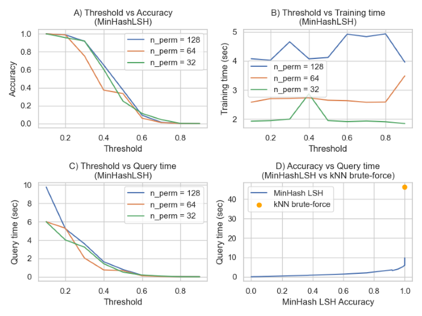

# MinHash LSH evaluation

This educational project assesses MinHash Locality Sensitive Hashing (LSH) for text document similarity. It compares LSH with a k-Nearest Neighbors (kNN) model using BART embeddings as ground truth. The project involves data preprocessing, shingle creation, and LSH experiments with varying parameters. Findings help understand LSH's efficiency and guide its use in document similarity tasks, enhancing knowledge of LSH techniques and applications.

## Python Requirements
1. datasketch - !pip install datasketch
2. contractions - !pip install contractions
3. transformers - !pip install transformers
4. nltk - !pip install nltk
5. sklearn - !pip install sklearn
6. BeautifulSoup - !pip install bs4
7. torch - !pip install torch
8. seaborn - !pip install seaborn

## Insights

The project's visualizations offer valuable insights into the performance of the MinHash LSH model.

  

* **Plot A**: The significance of the threshold on MinHash LSH accuracy is evident, as expected. Additionally, the number of permutations positively impacts accuracy across most threshold values. 
* **Plot B**: We observe that threshold has minimal influence on training time, while the number of permutations directly affects training time, with more permutations resulting in higher times. 
* **Plot C**: Reveals a relationship between threshold and query time, with smaller thresholds leading to longer query times as the predicted neighbor set grows, a trend also observed with the number of permutations.
* **Plot D**: Illustrates the significant advantage of MinHash LSH in efficiently identifying true neighbors compared to kNN brute-force, highlighting the trade-off between false positives and false negatives.

## License
This project is licensed under the MIT License - see the [LICENSE](LICENSE) file for details.
